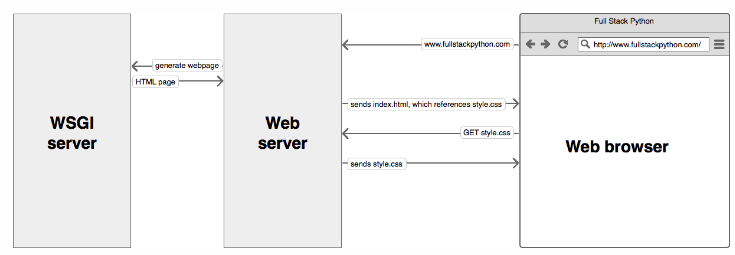

Page last revised on: {{ git_revision_date }}

#### Why use Gunicorn and Nginx?

Imagine if you had to do everything yourself with every new web application you build:

* Host static files
* Handle https connections
* Recover from crashes
* Make sure your application can scale up (via framework or your own code)

That sounds like a lot of work. 
And a lot of work which is the same across most web applications you might come up with.

**This is good news!** Because those problems are so common, you can build tools which take care of them. You don’t even need to put that functionality into your web framework of choice.

Three common building blocks when deploying a Python web application to production are:

* A web server (like nginx)
* A WSGI (Web Server Gateway Inteface) application server (like Gunicorn)
* Your actual application (written using a developer-friendly framework like Django)

The web server *accepts requests, takes care of general domain logic and takes care of handling https connections*. Only requests which are meant to arrive at the application are passed on toward the application server and the application itself. The application code does not care about anything except being able to process single requests.

Gunicorn takes care of everything which happens in-between the web server and your web application. This way, when coding up your a Django application you don’t need to find your own solutions for:

* communicating with multiple web servers
* reacting to lots of web requests at once and distributing the load
* keepiung multiple processes of the web application running

It's a good strategy running our Python Web Application in a WSGI Server. This way, deployment will be more stable, be able to handle more requests at once and be fast about it.

