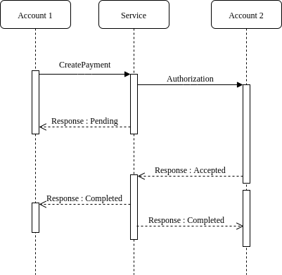

Page last revised on: {{ git_revision_date }}

## Payment

> All incoming and outgoing payments are represented as transactions and are processed in two stages from the user's perspective:

> - a new transaction is created.
> - the authorization transaction is accepted/declined .

> A new transaction has pending state, and a processed transaction's state can be one of completed, failed, reverted or declined.

#### Create Payment

*This endpoint creates a new payment.*

##### Request

    POST account/id/payment

**Content-Type** : application/json

!!! warning
    To avoid duplicate payment submission because of an error in your code, **request_id** must be unique for each submitted payment. The **request_id** must be previously persisted on your side.

| Field           | Description                                                   | Format                     |
|:-------------:  |:----------------------------------------------                |:--------------------------:|
| request_id	  | the client provided ID of the transaction (40 characters max) |	Text                       |  
| seller_id    |	the ID of the receiving account                               |	UUID                       |
| currency        |	the transaction currency                                      |	3-letter ISO currency code |
| reference       |	an optional textual reference shown on the transaction        | Text                       |

##### Response

**Content-Type** : application/json

| Field         | Description                                                           | Format                     |
|:-------------:|:----------------------------------------------                        | :-------------------------:|
| id            | the ID of the created payment                                     |	UUID                     |

--------

#### Get Payments

*This endpoint list all payments made by an account.*

##### Request

    GET /account/<id>/payments

##### Response

**Content-Type** : application/json

| Field           | Description                                                   | Format                     |
|:-------------:  |:----------------------------------------------                |:--------------------------:|
| id	          | The payment id                                                |	Text                       |  
| request_id	  | the client provided ID of the transaction (40 characters max) |	Text                       |  
| seller_id       |	the ID of the receiving account                               |	UUID                       |
| created_at      | The date when the payment was created                         | ISO date/time              |
| currency        |	the transaction currency                                      |	3-letter ISO currency code |
| amount          | The value of the payment                                      | Decimal                    |
| state           | The state of the payment 'pending, completed or cancelled'    | Text                       |
| reference       |	an optional textual reference shown on the transaction        | Text                       |
--------

#### Create Transaction

*This endpoint creates a transaction associated with a payment*

##### Request

    POST /payment/<id>/transactions

**Content-Type** : application/json

| Field         | Description                                                   | Format                     |
|:-------------:|:----------------------------------------------                |:--------------------------:|
| amount        | amount to add to account                                      | Decimal                    |
| reference     | an optional textual reference shown on the transaction        | Text                       |

##### Response

**Content-Type** : application/json

| Field         | Description                                   | Format                     |
|:-------------:|:----------------------------------------------| :-------------------------:|
| id            | the ID of the created transaction             | UUID                       |

----

#### Cancel Transaction

 *This endpoint cancel a transaction associated with a payment*

##### Request

    POST /payment/<payment_id>/transactions/<transaction_id>/cancel

#### Execute the payment

 *This endpoint*

##### Request

    POST /payment/<id>/execute

##### Response

**Content-Type** : application/json

[General Response]

--------

#### Authorization payment 

*This endpoint creates a payment confirmation.*

##### Request

    POST /payment/<id>/authorize

##### Response

**Content-Type** : application/json

[General Response]

--------

#### Get transactions

 *This endpoint give all the transactions information*

##### Request

    GET /payment/<id>/transactions

##### Response

**Content-Type** : application/json

| Field         | Description                                                           | Format                     |
|:-------------:|:----------------------------------------------                        | :-------------------------:|
| id            | the ID of the created transaction                                     |	UUID                     |
| amount        | The amount of the transaction                                         |   Decimal                  |
| state	        | the transaction state: *completed*, *declined* or *failed*            |	Text                     |
| id_payment    | The id of the payment which the transaction is associated             |	UUID                     |
| emission_date | the instant when the transaction was created	                        | ISO date/time              |
| update_date	| the instant when the transaction was completed                        | ISO date/time              |

----

#### Get Transaction

 *This endpoint gives information about a specific transaction*

##### Request
    GET /payment/<payment_id>/transactions/<transaction_id>

##### Response 

**Content-Type** : application/json

| Field         | Description                                                           | Format                     |
|:-------------:|:----------------------------------------------                        | :-------------------------:|
| id            | the ID of the created transaction                                     |	UUID                     |
| amount        | The amount of the transaction                                         |   Decimal                  |
| state	        | the transaction state: *completed*, *declined* or *failed*            |	Text                     |
| id_payment    | The id of the payment which the transaction is associated             |	UUID                     |
| emission_date | the instant when the transaction was created	                        | ISO date/time              |
| update_date	| the instant when the transaction was completed                        | ISO date/time              |
